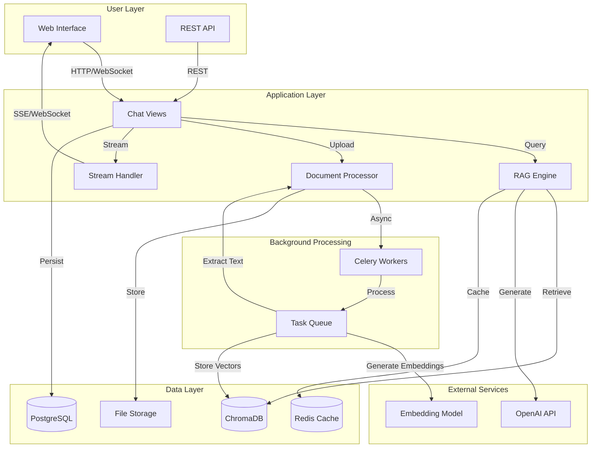
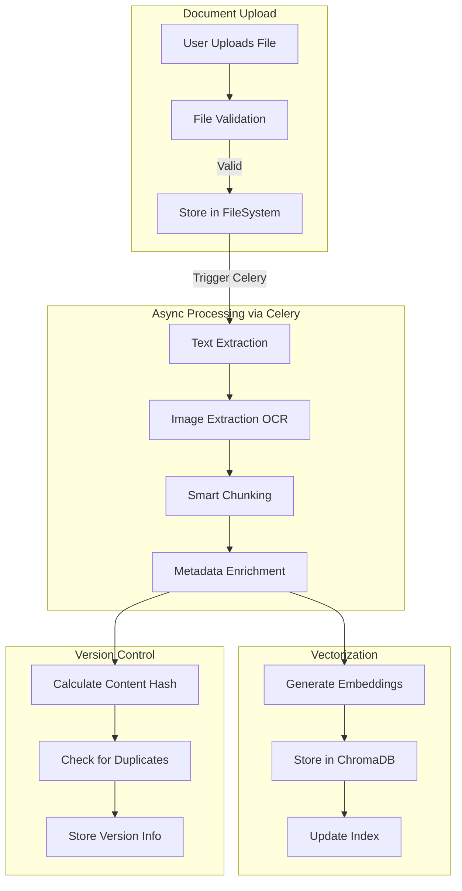
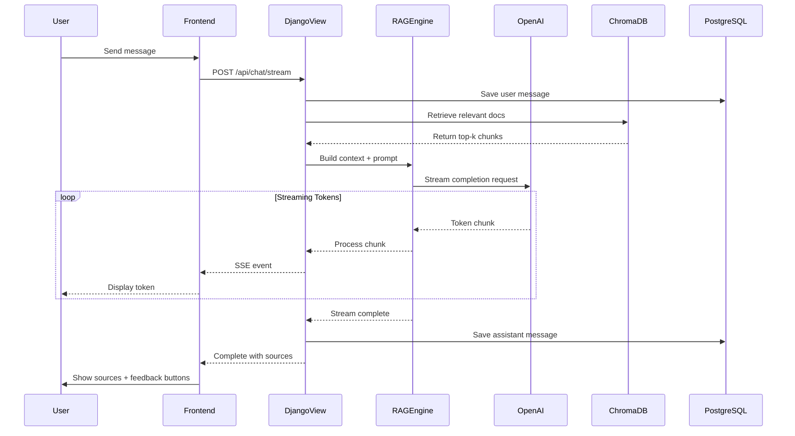
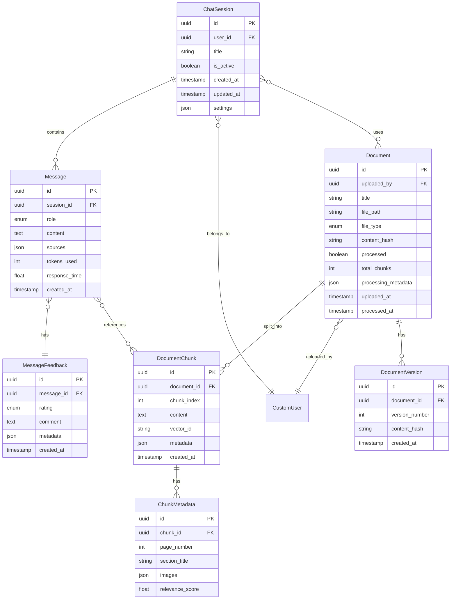

# RAG-Powered Chatbot Architecture for I Hear Data Collection System

## Architecture Overview

This architecture integrates a sophisticated RAG (Retrieval-Augmented Generation) chatbot into your existing Django platform, leveraging your current infrastructure (Celery, Redis, PostgreSQL, OpenAI) while adding new capabilities for document processing, semantic search, and conversational AI.

### High-Level System Architecture




## Core Components Deep Dive

### 1. RAG Pipeline Architecture

```mermaid
flowchart LR
    subgraph Input [Input Processing]
        UserQuery[User Query]
        ChatHistory[Chat History]
    end

    subgraph Retrieval [Retrieval Phase]
        QueryEmbed[Query Embedding]
        VectorSearch[Vector Similarity Search]
        Rerank[Re-ranking]
        ContextBuilder[Context Builder]
    end

    subgraph Generation [Generation Phase]
        PromptTemplate[Prompt Template]
        LLMCall[LLM API Call]
        StreamParser[Stream Parser]
        ResponseFormat[Response Formatter]
    end

    subgraph Output [Output Handling]
        UserResponse[User Response]
        SourceAttribution[Source Attribution]
        FeedbackCapture[Feedback Capture]
    end

    UserQuery --> QueryEmbed
    ChatHistory --> ContextBuilder
    QueryEmbed --> VectorSearch
    VectorSearch --> Rerank
    Rerank --> ContextBuilder
    ContextBuilder --> PromptTemplate
    PromptTemplate --> LLMCall
    LLMCall --> StreamParser
    StreamParser --> ResponseFormat
    ResponseFormat --> UserResponse
    ResponseFormat --> SourceAttribution
    UserResponse --> FeedbackCapture
```




### 2. Document Processing Pipeline




### 3. Real-Time Streaming Architecture




## Database Schema Design

### Entity Relationship Diagram




## Component Implementation Details

### A. RAG Service Layer (`chatbot/services/rag_service.py`)

**Responsibilities:**

- Manage vector store (ChromaDB) connections
- Generate embeddings via OpenAI
- Perform semantic search with re-ranking
- Build context-aware prompts
- Handle streaming responses
- Cache frequent queries in Redis

**Key Features:**

- Hybrid search (semantic + keyword)
- Query expansion for better retrieval
- Source attribution and citation
- Response quality scoring

### B. Document Processing Service (`chatbot/services/document_processor.py`)

**Responsibilities:**

- Extract text from PDFs, DOCX, TXT, Markdown
- OCR for images within documents using Tesseract/Azure OCR
- Smart chunking with semantic boundaries
- Generate metadata (headings, sections, page numbers)
- Calculate content hashes for versioning

**Chunking Strategy:**

- Respect document structure (headers, paragraphs)
- 800-1200 token chunks with 150 token overlap
- Maintain context windows for better retrieval

### C. Streaming Service (`chatbot/services/streaming_service.py`)

**Responsibilities:**

- Handle Server-Sent Events (SSE) connections
- Parse and format streaming tokens
- Handle connection drops gracefully
- Accumulate full response for storage

**Implementation:**

- Use Django StreamingHttpResponse
- Implement heartbeat mechanism
- Support graceful cancellation

### D. Feedback Service (`chatbot/services/feedback_service.py`)

**Responsibilities:**

- Collect user ratings (thumbs up/down)
- Store feedback comments
- Track response quality metrics
- Generate improvement reports

## API Design

### RESTful Endpoints

**Session Management:**

```javascript
POST   /api/chatbot/sessions/           - Create new chat session
GET    /api/chatbot/sessions/           - List user's sessions
GET    /api/chatbot/sessions/{id}/      - Get session details
PATCH  /api/chatbot/sessions/{id}/      - Update session (title, settings)
DELETE /api/chatbot/sessions/{id}/      - Delete session
```

**Messaging:**

```javascript
POST   /api/chatbot/sessions/{id}/messages/        - Send message (non-streaming)
POST   /api/chatbot/sessions/{id}/messages/stream/ - Send message (SSE streaming)
GET    /api/chatbot/sessions/{id}/messages/        - List messages in session
```

**Document Management:**

```javascript
POST   /api/chatbot/documents/            - Upload document
GET    /api/chatbot/documents/            - List documents
GET    /api/chatbot/documents/{id}/       - Get document details
DELETE /api/chatbot/documents/{id}/       - Delete document
GET    /api/chatbot/documents/{id}/status/ - Get processing status
```

**Feedback:**

```javascript
POST   /api/chatbot/messages/{id}/feedback/  - Submit feedback
GET    /api/chatbot/analytics/feedback/      - Get feedback analytics
```


### Request/Response Examples

**Send Message (Streaming):**

```json
POST /api/chatbot/sessions/{session_id}/messages/stream/

Request:
{
  "message": "How do I configure audio processing?",
  "include_sources": true
}

Response (SSE Stream):
data: {"type": "token", "content": "To"}
data: {"type": "token", "content": " configure"}
data: {"type": "token", "content": " audio"}
data: {"type": "source", "doc_id": "...", "title": "Setup Guide", "excerpt": "..."}
data: {"type": "complete", "message_id": "...", "tokens": 150}
```


## Technology Stack

### Core Dependencies (New)

```python
# Vector Database
chromadb==0.4.22
sentence-transformers==2.2.2

# Document Processing
pypdf==3.17.4
python-docx==1.1.0
pytesseract==0.3.10  # OCR for images
Pillow==10.2.0

# Streaming
sse-starlette==2.0.0  # For SSE support

# Existing (already in requirements.txt)
langchain==0.3.24
langchain-openai==0.3.14
langchain-community==0.3.22
openai==1.101.0
```


### Infrastructure Components

**Already Available:**

- PostgreSQL 16 for relational data
- Redis 7 for caching and task queue
- Celery for async processing
- Docker for containerization

**New:**

- ChromaDB for vector storage (local persistence)
- Server-Sent Events for streaming

## Security & Performance

### Security Measures

1. **Access Control:**

- User can only access their own sessions/documents
- Admin panel for document approval/moderation
- Rate limiting per user (30 queries/minute)

2. **Data Privacy:**

- Document encryption at rest (optional)
- PII detection and masking
- Audit logs for document access

3. **Input Validation:**

- File type whitelist (PDF, DOCX, TXT, MD)
- File size limits (25MB per document)
- Content scanning for malicious code

### Performance Optimizations

1. **Caching Strategy:**

- Redis cache for frequent queries (1-hour TTL)
- Embedding cache to avoid recomputation
- Session context caching

2. **Database Optimization:**

- Indexed queries on session_id, user_id, created_at
- Pagination for message lists
- Batch processing for document chunks

3. **Async Processing:**

- Celery tasks for document processing (no blocking)
- Task priorities (user-initiated > batch)
- Progress tracking for long operations

## File Structure

```javascript
datacollection/
├── chatbot/                          # New app
│   ├── __init__.py
│   ├── admin.py                      # Admin interface for documents
│   ├── apps.py
│   ├── models.py                     # ChatSession, Message, Document, etc.
│   ├── serializers.py                # DRF serializers
│   ├── urls.py                       # API endpoints
│   ├── views.py                      # View logic
│   ├── services/
│   │   ├── __init__.py
│   │   ├── rag_service.py           # Core RAG engine
│   │   ├── document_processor.py    # Document parsing & chunking
│   │   ├── streaming_service.py     # SSE streaming handler
│   │   ├── feedback_service.py      # Feedback collection
│   │   └── cache_service.py         # Redis caching logic
│   ├── tasks.py                      # Celery tasks for processing
│   ├── permissions.py                # DRF permissions
│   ├── templates/
│   │   └── chatbot/
│   │       ├── home.html            # Main chat interface
│   │       ├── session_list.html    # Session sidebar
│   │       └── document_manager.html # Document upload/management
│   ├── static/
│   │   └── chatbot/
│   │       ├── js/
│   │       │   ├── chat.js          # Chat UI logic
│   │       │   ├── streaming.js     # SSE client
│   │       │   └── document_upload.js
│   │       └── css/
│   │           └── chatbot.css
│   ├── migrations/
│   └── tests/
│       ├── test_rag_service.py
│       ├── test_document_processor.py
│       └── test_views.py
├── chroma_db/                        # Vector database storage (gitignored)
├── media/
│   └── chatbot/
│       └── documents/                # Uploaded documents
└── requirements.txt                  # Updated with new dependencies
```


## Implementation Phases

### Phase 1: Core Infrastructure

**Files to create:**

- [`chatbot/models.py`](chatbot/models.py) - Database models
- [`chatbot/services/rag_service.py`](chatbot/services/rag_service.py) - Basic RAG without streaming
- [`chatbot/services/document_processor.py`](chatbot/services/document_processor.py) - Text extraction only

**Key features:**

- Basic Q&A without streaming
- PDF and TXT document support
- Simple chat interface

### Phase 2: Async Processing & Multimodal

**Files to create:**

- [`chatbot/tasks.py`](chatbot/tasks.py) - Celery tasks for document processing
- Update [`chatbot/services/document_processor.py`](chatbot/services/document_processor.py) - Add OCR for images

**Key features:**

- Background document processing
- Image extraction and OCR
- Processing progress tracking

### Phase 3: Streaming & Feedback

**Files to create:**

- [`chatbot/services/streaming_service.py`](chatbot/services/streaming_service.py)
- [`chatbot/services/feedback_service.py`](chatbot/services/feedback_service.py)
- Update frontend with SSE client

**Key features:**

- Real-time streaming responses
- User feedback collection
- Response quality tracking

### Phase 4: Advanced Features

**Files to enhance:**

- [`chatbot/services/rag_service.py`](chatbot/services/rag_service.py) - Add hybrid search, re-ranking
- [`chatbot/admin.py`](chatbot/admin.py) - Analytics dashboard

**Key features:**

- Query caching in Redis
- Analytics dashboard
- Document versioning
- Admin moderation tools

## Configuration Updates

### Update [`datacollection/settings.py`](datacollection/settings.py):

```python
INSTALLED_APPS = [
    # ... existing apps ...
    'chatbot',
]

# Chatbot Configuration
CHATBOT = {
    'VECTOR_DB': {
        'PATH': os.path.join(BASE_DIR, 'chroma_db'),
        'COLLECTION_NAME': 'project_documents',
    },
    'EMBEDDINGS': {
        'MODEL': 'text-embedding-3-small',  # OpenAI embedding model
        'DIMENSIONS': 1536,
    },
    'RAG': {
        'CHUNK_SIZE': 1000,
        'CHUNK_OVERLAP': 200,
        'TOP_K_RESULTS': 4,
        'ENABLE_RERANKING': True,
    },
    'RATE_LIMITS': {
        'MESSAGES_PER_MINUTE': 30,
        'DOCUMENTS_PER_DAY': 50,
    },
    'DOCUMENT': {
        'MAX_FILE_SIZE_MB': 25,
        'ALLOWED_EXTENSIONS': ['pdf', 'docx', 'txt', 'md'],
        'ENABLE_OCR': True,
    },
}
```


### Update [`datacollection/urls.py`](datacollection/urls.py):

```python
urlpatterns = [
    # ... existing patterns ...
    path('api/chatbot/', include('chatbot.urls')),
]
```


## Testing Strategy

1. **Unit Tests:**

- Document parsing accuracy
- Embedding generation
- Vector retrieval precision

2. **Integration Tests:**

- End-to-end RAG pipeline
- Streaming response handling
- Celery task execution

3. **Performance Tests:**

- Query latency (<2s for retrieval)
- Streaming throughput
- Concurrent user handling

## Monitoring & Observability

**Key Metrics to Track:**

- Query response time (p50, p95, p99)
- Document processing time
- Cache hit rate
- User satisfaction (feedback scores)
- Token usage per query
- Error rates

**Logging:**

- Query logs with anonymized content
- Document processing logs
- Error traces with context

## Migration Plan

Since you're in an existing production system:

1. **Create chatbot app** in separate Django app (no impact on existing features)
2. **Run migrations** to create new tables
3. **Deploy Celery tasks** for document processing
4. **Add frontend** accessible via new URL path
5. **Monitor** usage and performance
6. **Iterate** based on user feedback

## Key Design Decisions

### Why ChromaDB?

- Lightweight, embeddable vector database
- No separate service to manage
- Persists to disk automatically
- Good for medium-scale deployments
- Easy migration to Pinecone/Weaviate later if needed

### Why Server-Sent Events (SSE)?

- Simpler than WebSockets for one-way streaming
- Works with existing HTTP infrastructure
- Better browser compatibility
- Automatic reconnection support

### Why Separate Models?

- Isolation from existing audio data models
- Independent schema evolution
- Clear domain boundaries
- Easier testing and maintenance

## Expected Performance Characteristics

- **Query Latency:** 1-3 seconds (retrieval + generation)
- **Streaming Start:** <500ms (first token)
